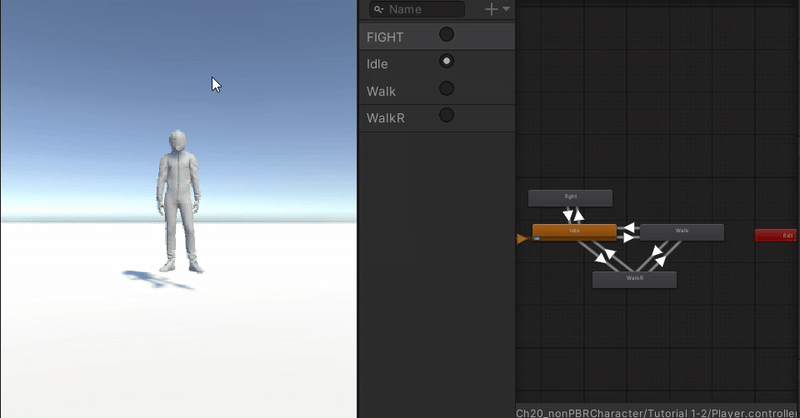
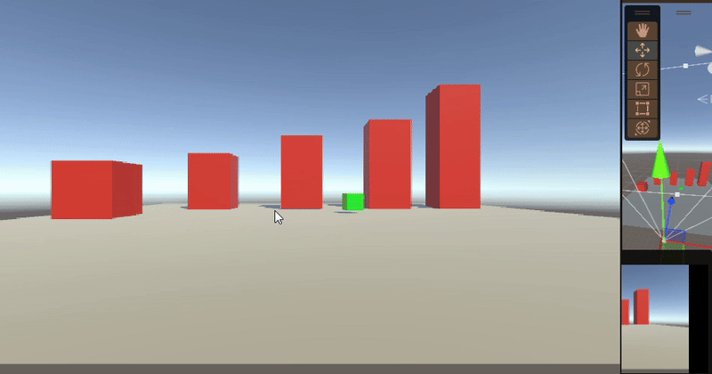
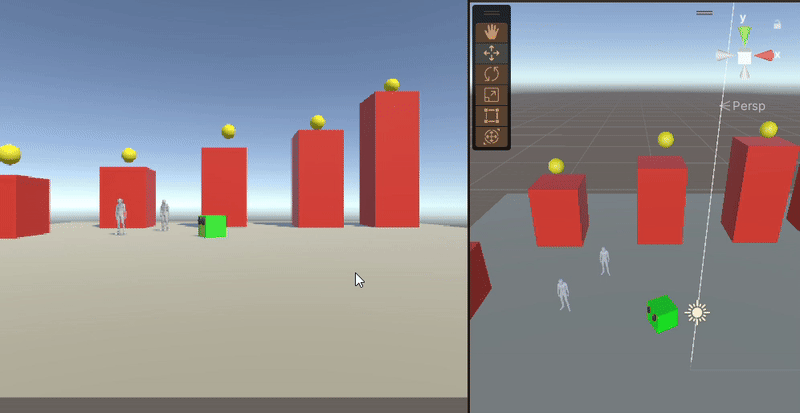

# Tutorials 1-2

This project includes two key scripts for animating a player and handling basic movement. Below are the details on how to integrate and use the provided scripts.

## Files

1. **AnimatePlayer.cs**  
   [Link to AnimatePlayer.cs Script](https://github.com/zmbfiedk/Tutorials1.3prog/blob/main/Assets/Scripts/AnimatePlayer.cs)  
   This script is responsible for animating the player. It should be attached to your player object and will control the animation states based on the player's movement.

2. **MoveBasic.cs**  
   [Link to MoveBasic.cs Script](https://github.com/zmbfiedk/Tutorials1.3prog/blob/main/Assets/Scripts/MoveBasic.cs)  
   This script handles the basic movement controls for the player. It uses Unity's Input system to allow the player to move in a 2D or 3D environment.

## GIF Demonstration

# Tutorial 3

This project introduces a jump mechanic for the player. Below are the details on how to integrate and use the provided script.

## Files

1. **Jump.cs**  
   [Link to Jump.cs Script](https://github.com/zmbfiedk/Tutorials1.3prog/blob/main/Assets/Scripts/Jump.cs)  
   This script handles the player's jumping functionality. It should be attached to your player object and allows the player to jump when the jump input is triggered.

## GIF Demonstration

# Tutorial 4

This project introduces the functionality to collect pickups and track the player's score. Below are the details on how to integrate and use the provided scripts.

## Files

1. **GetPickup.cs**  
   [Link to GetPickup.cs Script](https://github.com/zmbfiedk/Tutorials1.3prog/blob/main/Assets/Scripts/GetPickup.cs)  
   This script is responsible for detecting when the player collects a pickup. It adds to the player's score when a pickup is collected.

2. **KeepScore.cs**  
   [Link to KeepScore.cs Script](https://github.com/zmbfiedk/Tutorials1.3prog/blob/main/Assets/Scripts/KeepScore.cs)  
   This script tracks and displays the player's score. It works in conjunction with `GetPickup.cs` to keep a running total of the score.

## GIF Demonstration

# Tutorial 5

This project introduces the functionality for shooting, killing on hit, and managing bullet movement. Below are the details on how to integrate and use the provided scripts.

## Files

1. **Kill on hit.cs**  
   [Link to Kill on hit.cs Script](https://github.com/zmbfiedk/Tutorials1.3prog/blob/main/Assets/Scripts/Kill%20on%20hit.cs)  
   This script is responsible for detecting when the player or enemy is hit by a bullet, and it handles the logic for killing the affected object.

2. **Shoot.cs**  
   [Link to Shoot.cs Script](https://github.com/zmbfiedk/Tutorials1.3prog/blob/main/Assets/Scripts/Shoot.cs)  
   This script controls the player's shooting mechanics, enabling the firing of bullets when the shoot input is triggered.

3. **MoveBullet.cs**  
   [Link to MoveBullet.cs Script](https://github.com/zmbfiedk/Tutorials1.3prog/blob/main/Assets/Scripts/MoveBullet.cs)  
   This script is responsible for the movement of the bullets, allowing them to travel across the screen after being fired.

4. **GetPickup.cs (Updated)**  
   [Link to GetPickup.cs Script](https://github.com/zmbfiedk/Tutorials1.3prog/blob/main/Assets/Scripts/GetPickup.cs)  
   This updated script handles the pickup collection logic and also integrates with the player's score, which increases as pickups are gathered.

## GIF Demonstration

# Tutorial 6

In Tutorial 6, we added several key scripts to enhance the game's functionality. Below are the details on each new script, along with updates to existing code:

## New Scripts

1. **[EnemyShoot.cs](https://github.com/zmbfiedk/Tutorials1.3prog/blob/main/Assets/Scripts/EnemyShoot.cs)**  
   This script is responsible for handling the shooting mechanics for enemies. It controls when and how enemies shoot at the player, including the bullet direction and timing.

2. **[CameraFollow.cs](https://github.com/zmbfiedk/Tutorials1.3prog/blob/main/Assets/Scripts/CameraFollow.cs)**  
   This script ensures the camera follows the player smoothly during movement, keeping the player in view as they navigate through the game environment.

3. **[Heart.cs](https://github.com/zmbfiedk/Tutorials1.3prog/blob/main/Assets/Scripts/Heart.cs)**  
   This script manages the heart-based life system, tracking the player's health and updating the visual representation of health hearts as the player takes damage or collects health.

4. **[Triggeranimation.cs](https://github.com/zmbfiedk/Tutorials1.3prog/blob/main/Assets/Scripts/Triggeranimation.cs)**  
   This script triggers specific animations based on various in-game events. It's responsible for ensuring that character animations are synchronized with the game state.

## Updated Code

1. **[Kill on hit.cs](https://github.com/zmbfiedk/Tutorials1.3prog/blob/main/Assets/Scripts/Kill%20on%20hit.cs)**  
   This script was updated to handle interactions where an enemy or object is destroyed upon collision with a bullet or another object.

2. **[Shoot.cs](https://github.com/zmbfiedk/Tutorials1.3prog/blob/main/Assets/Scripts/Shoot.cs)**  
   This script was updated to improve player shooting mechanics, including bullet trajectory, firing rate, and the interaction with the player's weapon.

## GIF Demonstration

.gif)

# Tutorial 7-8 - New Scripts and Code Updates

In Tutorials 7 and 8, we added and modified key scripts to introduce jumping mechanics and trap triggers. Below are the details on the new and updated scripts:

## New Scripts

1. **[Jump.cs](https://github.com/zmbfiedk/Tutorials1.3prog/blob/main/Assets/Scripts/Jump.cs)**  
   This script handles the player's jump mechanics, allowing the player to jump when certain conditions are met, such as pressing a jump button or colliding with a surface.

2. **[TrapTrigger.cs](https://github.com/zmbfiedk/Tutorials1.3prog/blob/main/Assets/Scripts/TrapTrigger.cs)**  
   This script manages the activation of traps when the player enters a specific trigger area. It can trigger various traps like spikes, falling objects, or other environmental hazards.

## GIF Demonstration

